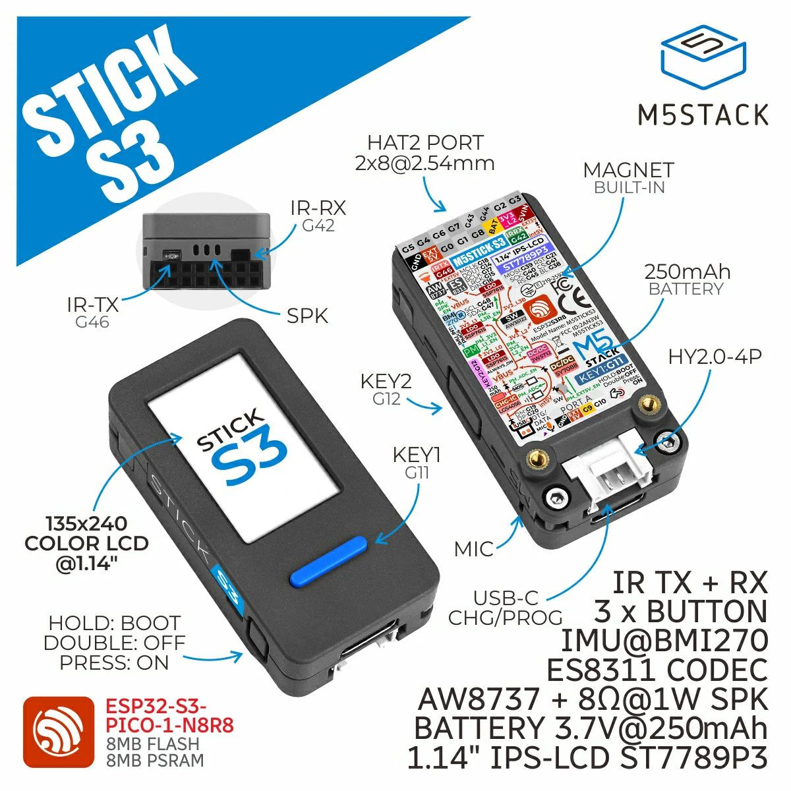
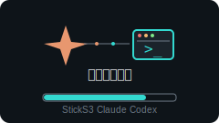
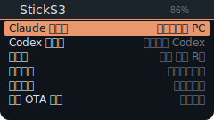
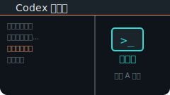
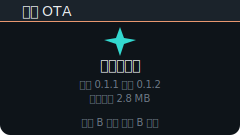

# StickS3 Claude Codex 小秘书

Author: 国产电灯泡

一个运行在 M5Stack StickS3 上的 Claude / Codex 语音小秘书，也包含仪表盘、红外遥控、网络电台和 OTA。

<p align="center">
  
</p>

## 界面预览

<p align="center">
  
  
  
  
</p>

## 功能

- Claude / Codex 小秘书：语音输入到电脑端，并显示实时状态
- 仪表盘：时间、天气、B 站粉丝数
- 红外遥控：学习和发送红外码
- 网络电台：在线收音机
- 本地 OTA 升级：WiFi 无线更新固件
- 设置：音量、亮度、旋转、熄屏、WiFi 配网、远程 OTA、系统诊断

## 使用

首次启动会创建热点 `StickS3-Setup`，连接后打开：

```text
http://192.168.4.1
```

在页面里配置 WiFi，并填写科大讯飞 IAT 应用的：

```text
APPID / APISecret / APIKey
```

语音识别需要用户自己的科大讯飞 API。固件不内置真实密钥。

## 编译

```powershell
python -m platformio run -d .
```

正式发布版会关闭核心调试日志：

```powershell
python -m platformio run -d . -e m5stack-sticks3-release
```

## 上传

USB 首次烧录：

```powershell
python -m platformio run -d . -t upload --upload-port COM6
```

OTA 上传：

```powershell
python -m platformio run -d . -t upload --upload-port 设备IP
```

远程 OTA 可放到 GitHub Release。固件里配置 `REMOTE_OTA_MANIFEST_URL` 后，板子在 **设置 → 远程 OTA** 里检查更新。

`manifest.json` 格式：

```json
{
  "version": "1.0.0",
  "url": "https://github.com/OWNER/REPO/releases/latest/download/firmware.bin",
  "sha256": "firmware.bin 的 sha256",
  "size": 2957445,
  "notes": "本次更新说明"
}
```

生成发布包：

```powershell
python helper\prepare_release.py --repo OWNER/REPO --notes "本次更新说明"
```

一键生成并发布到 GitHub Release（使用本机 Git Credential Manager 凭据，不依赖 `gh` token）：

```powershell
python helper\publish_release.py --repo OWNER/REPO --notes "本次更新说明" --sync-latest
```

版本源在 `release.json`，改版本后运行 `python helper\version_sync.py` 同步固件和助手版本。

## PC 助手

Claude / Codex 小秘书需要运行 Windows 助手：

```powershell
python helper\type_server.py
```

不想装 Python 的用户，可以从 GitHub Release 下载打包版：

```text
StickS3ClaudeCodexHelper.exe
```

右下角托盘图标可以打开配置、查看日志、检查并安装助手更新、导出诊断包、绑定 Claude/Codex 输入目标。配置窗口里也能查看当前绑定状态，并对 Claude/Codex 分别做测试粘贴。

开机自启：

- 下载版：右键托盘图标 → **打开配置** → 打开 **开机自启**
- 手动版：按 `Win + R`，输入 `shell:startup`，把助手 exe 的快捷方式放进去

推荐用法：

1. 先启动 PC 助手
2. 打开 Claude Code 或 Codex
3. 在托盘菜单里绑定对应的输入目标
4. 板子进入小秘书，长按 A 说话

如果在 VS Code 里焦点不稳定，再绑定一次对应的输入框位置。

## 密钥

不要提交真实密钥。

- `src/secrets.example.h` 是模板
- `src/secrets.h` 是本地私有文件，已加入 `.gitignore`
- 推荐通过 WiFi 配网页保存讯飞 API
- 远程 OTA 地址也可写在 `src/secrets.h`
- 固件和助手版本统一从 `release.json` 同步，不要在 `src/secrets.h` 里定义 `APP_VERSION`

## 说明

完整使用说明见 [USER_MANUAL.md](USER_MANUAL.md)。发布流程见 [docs/developer.md](docs/developer.md)。

## License

MIT License. See [LICENSE](LICENSE).
